# Fighting-game theme: art preview (iteration 1)

**Live animated preview:** [solo (iteration 1)](https://dfigravity.github.io/nowplaying-theme-sdk/demo/?solo) · [versus](https://dfigravity.github.io/nowplaying-theme-sdk/demo/). It autoplays a ~45 s loop; buttons trigger every move, special and super. `H` hides the controls, `?obs` makes it a transparent 1920x1080 browser source.

All art is original (no Capcom assets, fonts or names): hand-drawn pixel fonts, Endesga 32
palette snapped to 12-bit, under 15 colours per sprite, navy outlines so it reads over any camera.
The background in the screenshots is a blurred stand-in for a webcam; in OBS the overlay is
transparent. These come from a Canvas2D motion preview, not the Pixi theme, which is not built yet.

## The overlay at 1920x1080

### Solo (iteration 1), early combo
Top-left bar is the HYPE (super) meter; the centre shows BPM; combo counter, rank word (NICE), callout and the mascot Wax.

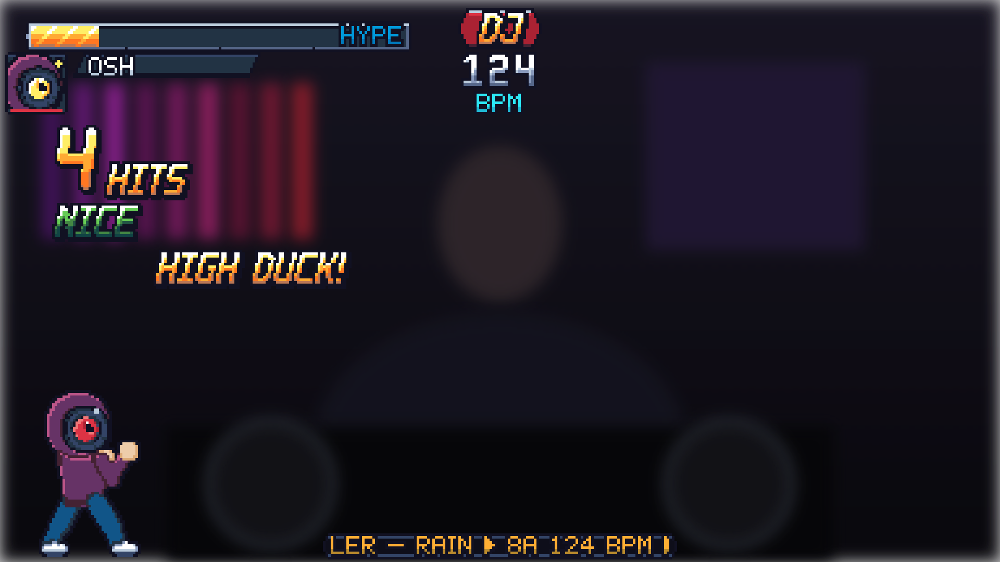

### Solo, a super firing
HYPE was full, so the special BLACKOUT DROP fires as HYPER BLACKOUT DROP: SUPER! callout, burst, sparks, Wax's super pose (label eye lights up), bar drains with x2 points.

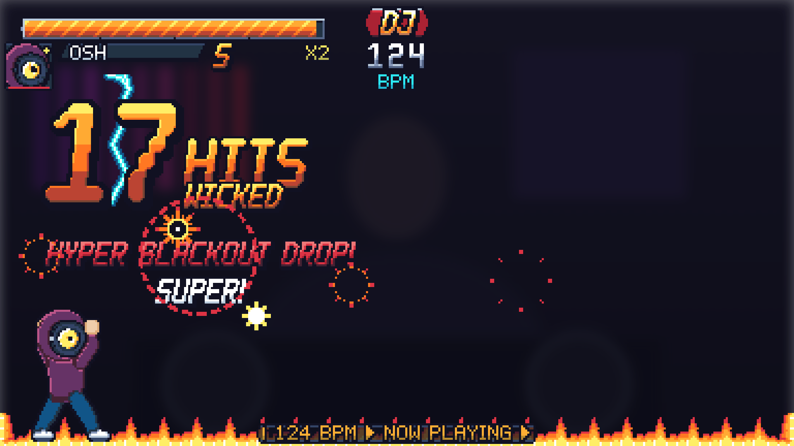

### Solo, 28 hits
From 15 hits the numerals go big and a fire border runs along the bottom; from 25 they turn red (MAXIMUM).

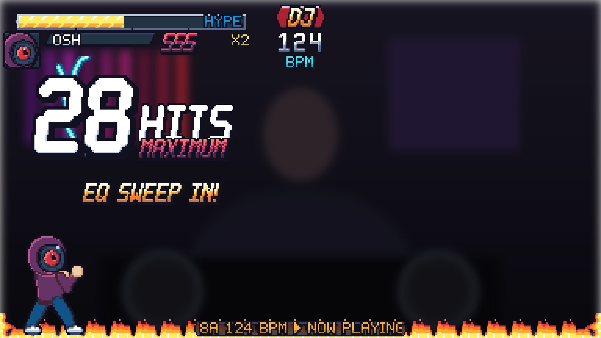

### Track change: the VS card
NOW (outgoing) vs NEXT (incoming) panels wipe in from both edges with titles, artist, key and BPM.

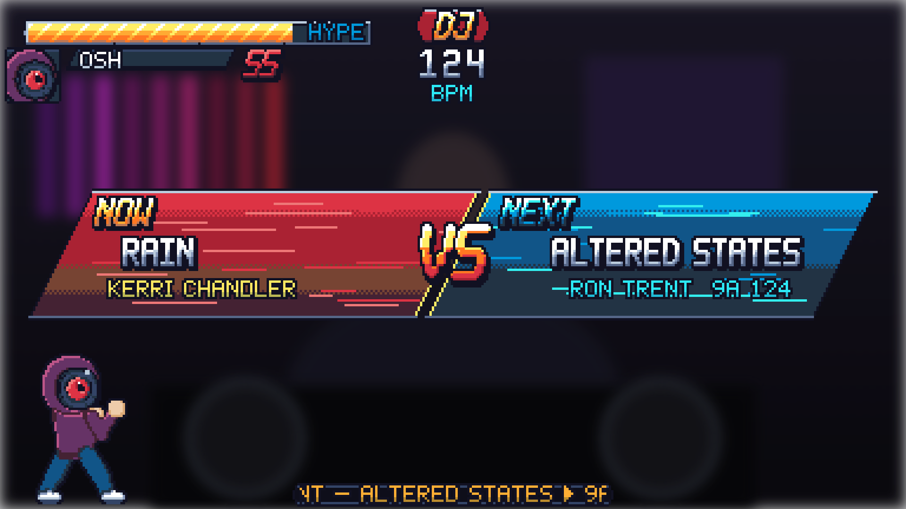

### Solo, top tier (40 hits)
ULTRA: rainbow numerals, fire top and bottom, lightning on both sides, MAX flashing.

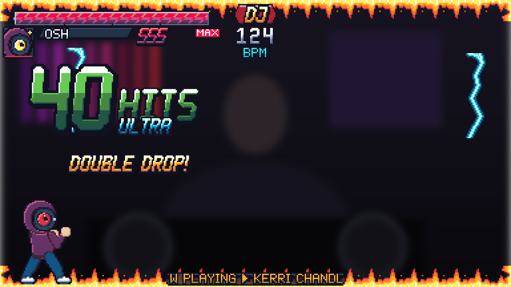

### Versus (iteration 2 option): a chat hit
For reference only: the DJ-vs-chat layout we parked per your iteration 1 call. A sub knocks a chunk off the DJ's bar (red trail).

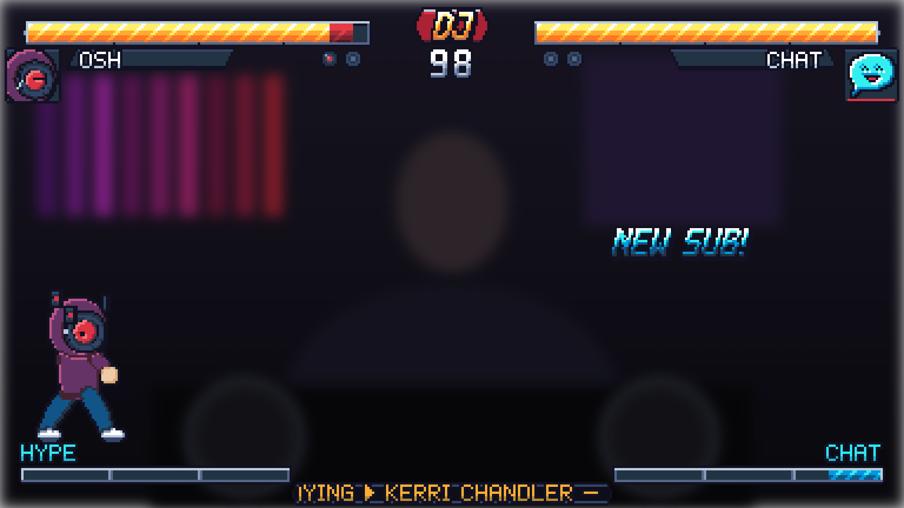

### Versus, a super
Same super, versus layout.

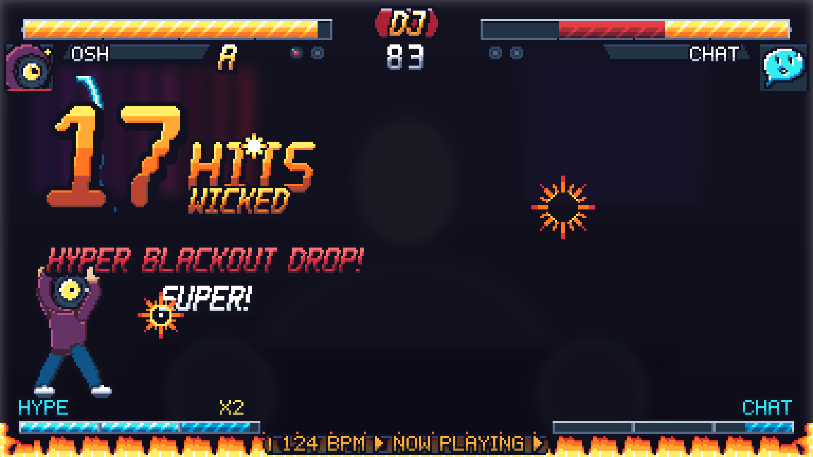

## Sprite sheets (enlarged; the real sheets are 1x pixel art at 384x216 virtual, scaled 5x)

**HUD: bars, fill tiles, DJ emblem, name plates, vinyl round markers, meters, MAX, ticker, small spark**

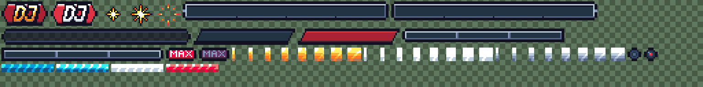

**Hit numerals 20x28, timer digits, labels**

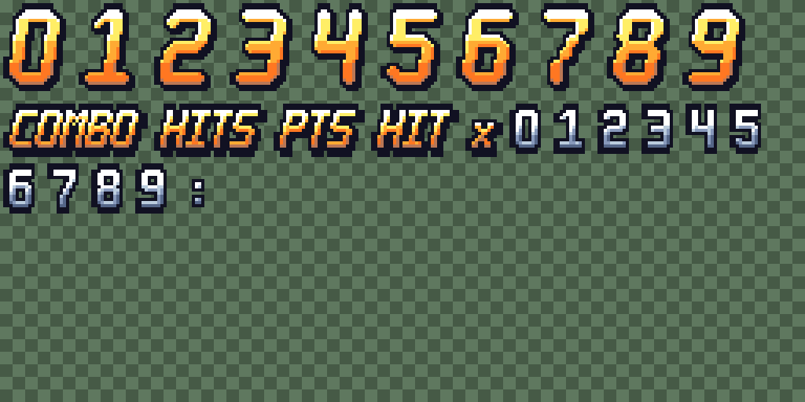

**Big numerals 40x56 (tier 4+)**

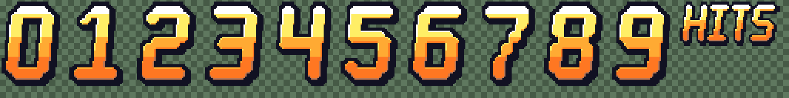

**Callout lettering, rank words (NICE, SOLID, WICKED, SAVAGE, LETHAL, MAXIMUM, ULTRA), style letters D to SSS**

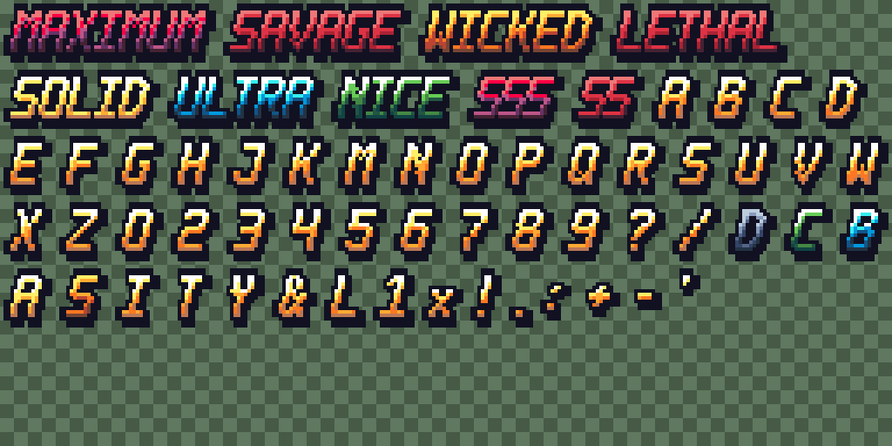

**Bold font for names and titles**

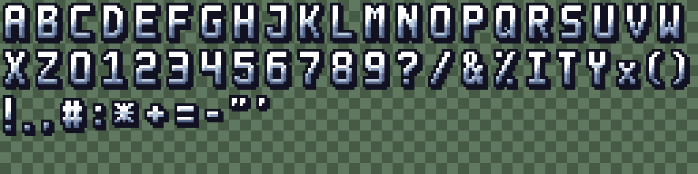

**Small font for the ticker and labels (full ASCII; lowercase and accents map to caps)**

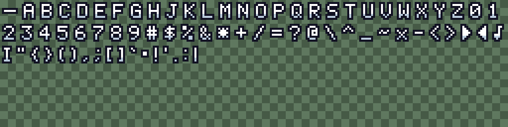

**Effects: super burst, lightning, sparks, fire border, slash, swap arrows, move-list icons**

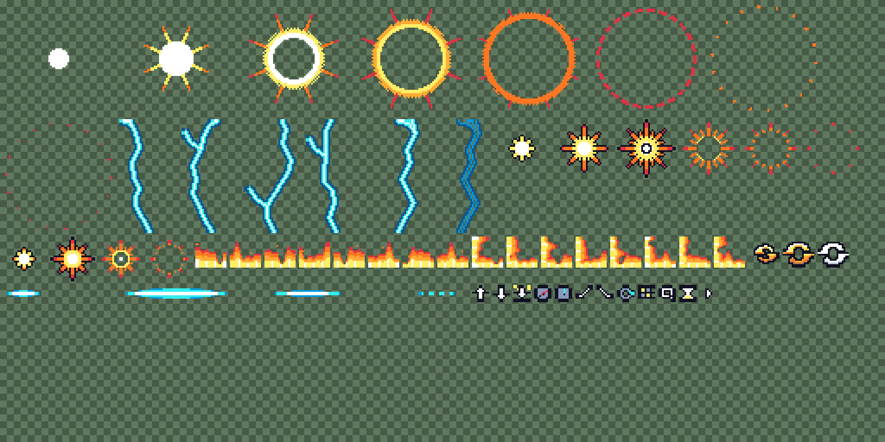

**Wax: idle, punch, super, hurt, dizzy, KO, win (64x64 frames)**

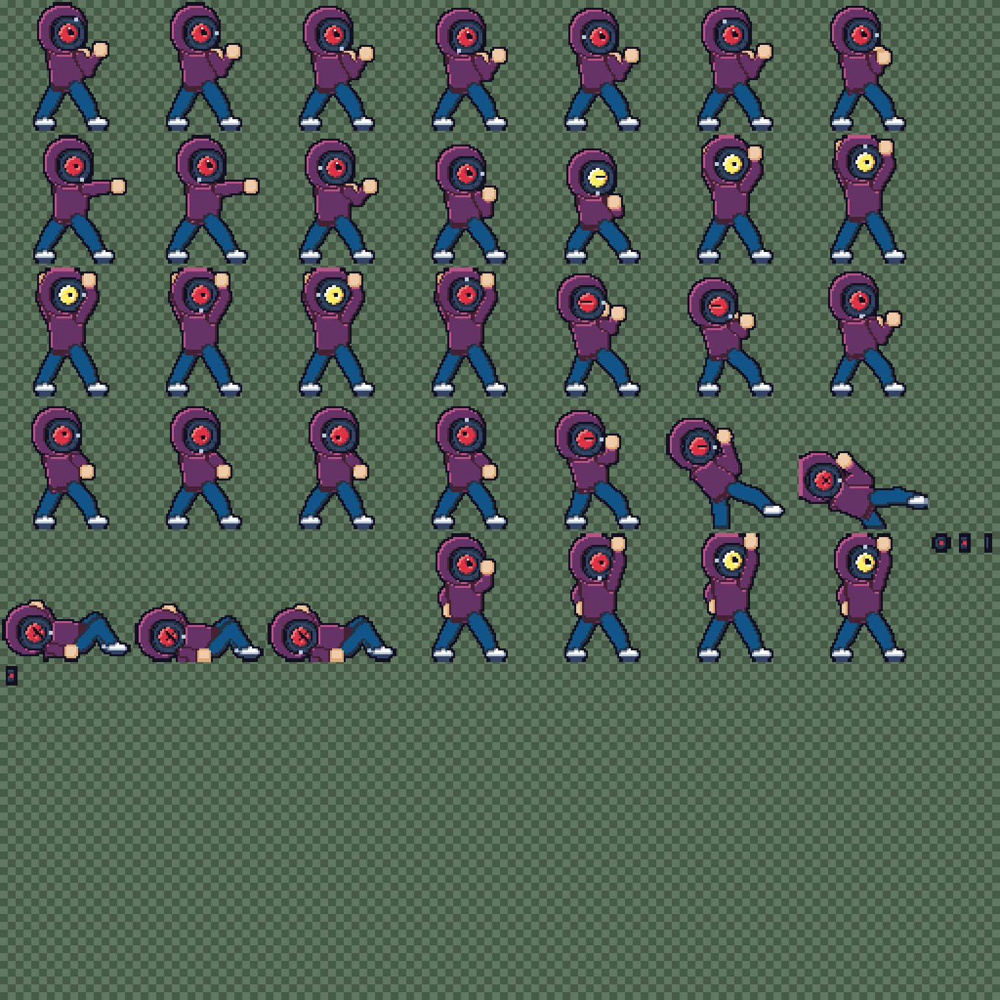

**Portraits: DJ (Wax) and CHAT, four moods each**

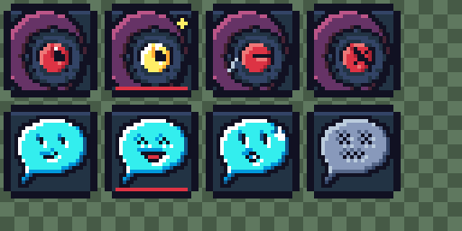

**VS card panels, wipe masks, VS glyph**

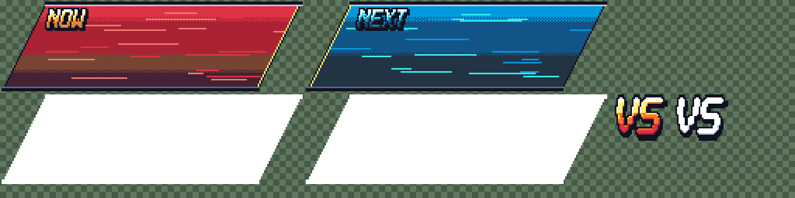
